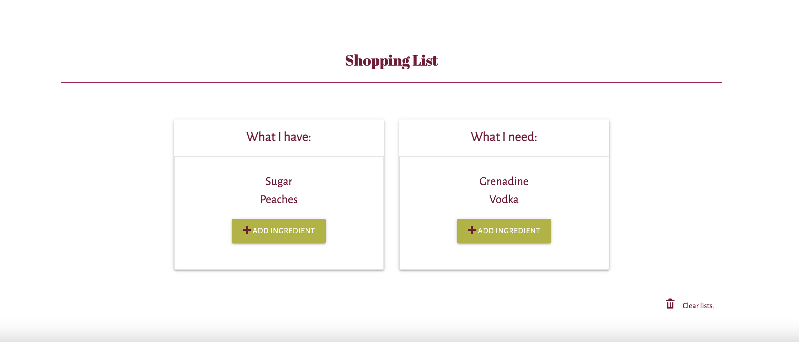

# <wind-hawks>

## iNeedADrink

## Description

iNeedADrink's vision was made for the working adult (over the age of 21) who would like to make a cocktail and does not know where to start. This application can help inspire new drink ideas, educate more on familar drinks, and help organize to make that craving a reality. This application uses technologies such as HTML, CSS, Javascript, jQuery & jQuery UI, Web API, Materialize CSS/JS library, Server-side APIs.

## Usage
Below the user will be able to,
1) The user can search for the name of drink they would like, or the ingrediant they have/like, or even a "random" option that will randomly select a drink from a large library of drinks.

2) Once the user has selected the picks what they want more information on, a recipe card will appear with information based on what they searched for. The user will be able to add as many drinks as they would like to the recipe card wit the ability to clear it if they would like to start over.

3)Finally, once the user is satisfied with the information they have found, they can organize a shopping list. The shopping list has both a section to track what the user has and what they need to assure they are successful in making their drink.

 
 
 
With iNeedADrink taking away the unknown, we encourage you to try out our application at <a href="https://github.com/charliec1665/wind-hawks">Wind Hawks Repo</a>

## Credits

Search by Name Function: <a href="https://github.com/abilodeau21">Andy Bilodeau</a>
Search by Ingredient Function: <a href="https://github.com/qclaytor30">Quincy Claytor</a>
Random Cocktail Generator: <a href="https://github.com/hnihT212">Thinh Nguyen</a>
Shopping List & Aesthetics: <a href="https://github.com/charliec1665">Charlie Carter</a>

Icons: <a href="https://www.vecteezy.com/free-vector/wine">Wine Vectors by Vecteezy</a>